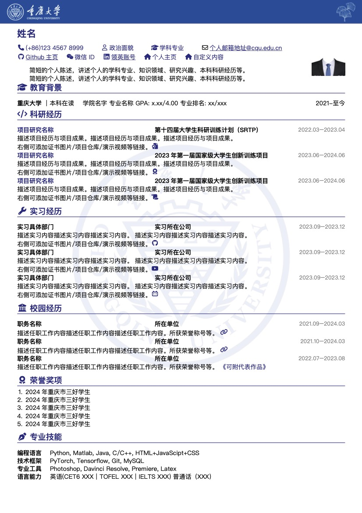

# Resume Template in Typst

使用 Typst 编写的简历模板.

代码上，以[OrangeX4](https://github.com/OrangeX4/Chinese-Resume-in-Typst) 所提供的模板为基础，增加了一定的行距控制，丰富了图标内容。同时也参考了一部分Typst的[中文手册](https://typst-doc-cn.github.io/docs/tutorial/).

功能与外观上，参考了[doubleZ](https://github.com/doubleZ0108)的个人简历作品，非常感谢大佬的耐心指导.图标来源：https://fontawesome.com/icons/

## 使用

### 本地编辑（推荐）

- 安装 VS Code，以及 Typst LSP 和 vscode-pdf 插件。
- 打开 `resume_gne.typ` 文件，按下 `Ctrl + K V` 快捷键后即可显示与编辑。
- 按下 `Shift + Ctrl + P` 后执行 `Typst: Export the currently open file as PDF` 即可导出 PDF 文件。

### 背景图
背景采用 Photoshop 单独制作，当然模板也在 material 文件夹内，可以根据需要修改成你想要的学校。

## 效果

